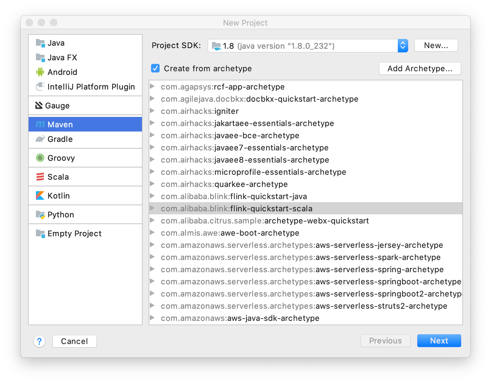
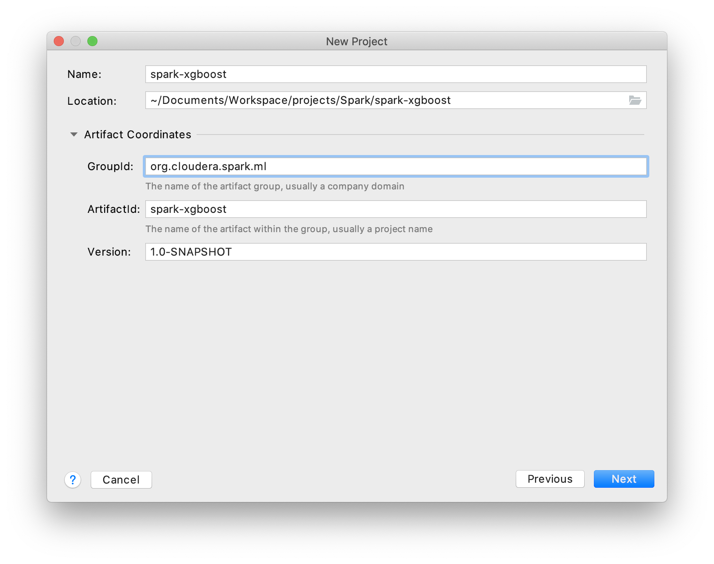
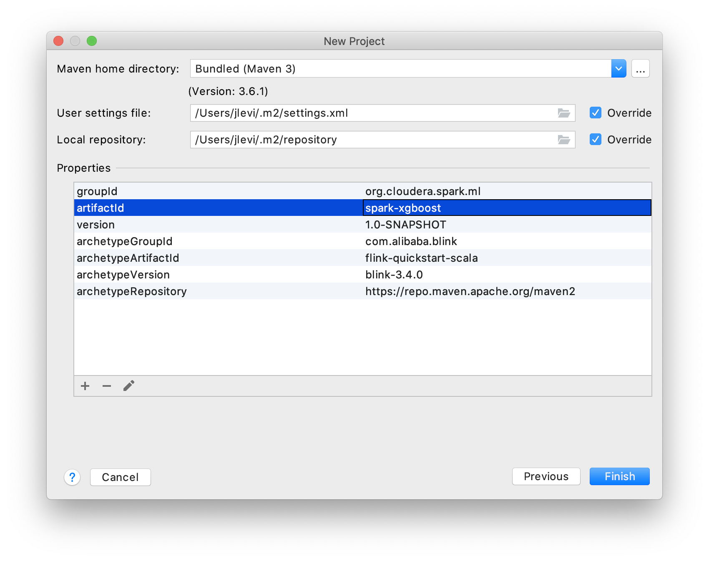
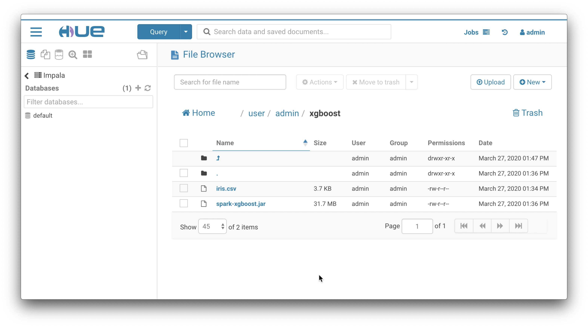

# XGBoost Spark in CDH 6.x

The current process explains how to run a custom Scala-Spark job with `spark-submit` in Cloudera's CDH 6.x command line. 

* Tools/Platform used
    * Cloudera Enterprise Data Hub cluster CDH 6.x
        * Spark 2.4.x
        * Scala 2.11.x
    * IntelliJ Community 2019.3
        * Scala Plugin
        * pom.xml 
            *  repository
                * scala-tools.org - Maven
                * Cloudera Repos
            *  dependencies
                * xgboost4j-spark
                * hadoop-client
                * spark-core_2.11
                * spark-mllib_2.11
            *  reporting
                * scala-maven-plugin
                
## IntelliJ Setup

* Create new project under File > New Project 


* Define Artifacts


* Define Maven Version


## Run project in Cloudera CDH 6.x

* Upload data file and JAR file to the HDFS directory `/user/admin/xgboost`



* Run Spark project's class name `com.cloudera.spark.ml.App`
    * data file: iris.csv
    * custom Spark code: spark-xgboost.jar
    * execute the following command: 
    ```bash
    [demo@host1]$ sudo -u spark /usr/bin/spark-submit \
    --class com.cloudera.spark.ml.App \
    --master local[*] \
    hdfs:///user/admin/xgboost/spark-xgboost.jar \
    hdfs:///user/admin/xgboost/iris.csv
```

* XGBoost job spark-submit output:

```bash
...
20/03/27 20:59:47 INFO scheduler.DAGScheduler: Job 4 finished: show at App.scala:83, took 0.236815 s
+-----------------+----------+--------------------+--------------------+----------+
|         features|classIndex|       rawPrediction|         probability|prediction|
+-----------------+----------+--------------------+--------------------+----------+
|[5.1,3.5,1.4,0.2]|       2.0|[-2.0648581981658...|[0.00411309069022...|       2.0|
|[4.9,3.0,1.4,0.2]|       2.0|[-2.0648581981658...|[0.00410979148000...|       2.0|
|[4.7,3.2,1.3,0.2]|       2.0|[-2.0648581981658...|[0.00411309069022...|       2.0|
|[4.6,3.1,1.5,0.2]|       2.0|[-2.0648581981658...|[0.00411292677745...|       2.0|
|[5.0,3.6,1.4,0.2]|       2.0|[-2.0648581981658...|[0.00411309069022...|       2.0|
|[5.4,3.9,1.7,0.4]|       2.0|[-2.0648581981658...|[0.00411309069022...|       2.0|
|[4.6,3.4,1.4,0.3]|       2.0|[-2.0648581981658...|[0.00411309069022...|       2.0|
|[5.0,3.4,1.5,0.2]|       2.0|[-2.0648581981658...|[0.00411309069022...|       2.0|
|[4.4,2.9,1.4,0.2]|       2.0|[-2.0648581981658...|[0.00410979148000...|       2.0|
|[4.9,3.1,1.5,0.1]|       2.0|[-2.0648581981658...|[0.00411292677745...|       2.0|
|[5.4,3.7,1.5,0.2]|       2.0|[-2.0648581981658...|[0.00411309069022...|       2.0|
|[4.8,3.4,1.6,0.2]|       2.0|[-2.0648581981658...|[0.00411309069022...|       2.0|
|[4.8,3.0,1.4,0.1]|       2.0|[-2.0648581981658...|[0.00410979148000...|       2.0|
|[4.3,3.0,1.1,0.1]|       2.0|[-2.0648581981658...|[0.00410979148000...|       2.0|
|[5.8,4.0,1.2,0.2]|       2.0|[-0.9882088899612...|[0.01197591237723...|       2.0|
|[5.7,4.4,1.5,0.4]|       2.0|[-0.9882088899612...|[0.01197591237723...|       2.0|
|[5.4,3.9,1.3,0.4]|       2.0|[-2.0648581981658...|[0.00411309069022...|       2.0|
|[5.1,3.5,1.4,0.3]|       2.0|[-2.0648581981658...|[0.00411309069022...|       2.0|
|[5.7,3.8,1.7,0.3]|       2.0|[-0.9882088899612...|[0.01197591237723...|       2.0|
|[5.1,3.8,1.5,0.3]|       2.0|[-2.0648581981658...|[0.00411309069022...|       2.0|
+-----------------+----------+--------------------+--------------------+----------+
only showing top 20 rows

20/03/27 20:59:47 INFO spark.SparkContext: Invoking stop() from shutdown hook
20/03/27 20:59:47 INFO server.AbstractConnector: Stopped Spark@117bcfdc{HTTP/1.1,[http/1.1]}{0.0.0.0:4041}
20/03/27 20:59:47 INFO ui.SparkUI: Stopped Spark web UI at http://<host1>:4041
20/03/27 20:59:47 INFO spark.MapOutputTrackerMasterEndpoint: MapOutputTrackerMasterEndpoint stopped!
20/03/27 20:59:47 INFO memory.MemoryStore: MemoryStore cleared
20/03/27 20:59:47 INFO storage.BlockManager: BlockManager stopped
20/03/27 20:59:47 INFO storage.BlockManagerMaster: BlockManagerMaster stopped
20/03/27 20:59:47 INFO scheduler.OutputCommitCoordinator$OutputCommitCoordinatorEndpoint: OutputCommitCoordinator stopped!
20/03/27 20:59:47 INFO spark.SparkContext: Successfully stopped SparkContext
20/03/27 20:59:47 INFO util.ShutdownHookManager: Shutdown hook called
20/03/27 20:59:47 INFO util.ShutdownHookManager: Deleting directory /tmp/spark-5220564c-9f44-4b60-b26a-a0e21ff454b9
20/03/27 20:59:47 INFO util.ShutdownHookManager: Deleting directory /tmp/spark-05edb427-0518-4f67-a164-93cbdd228d92
```


